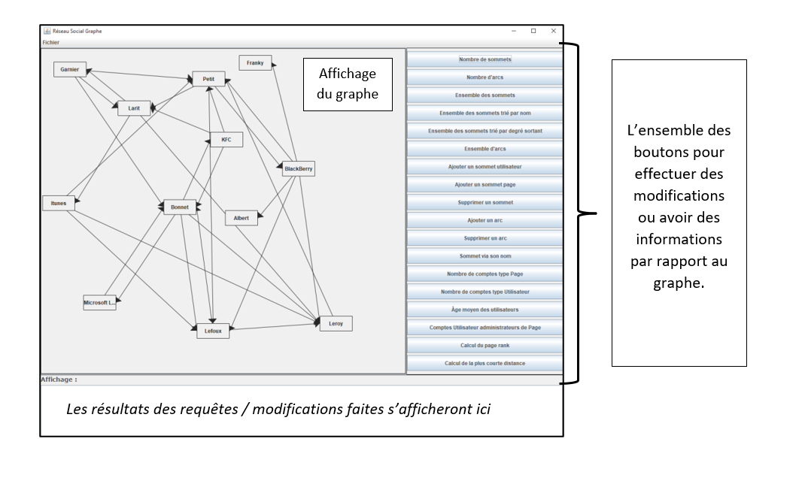

# Projet de graphe      

##### La compilation de l'application :

Lors de l'étape de compilation, vous devez être dans le dossier `src` du projet.
Exemple du dossier où vous devez vous situer : `<C:\Graphe\src>`
Ensuite, veuillez éxécuter la commande suivante : `javac @compile.list` ou `javac "@compile.list"`

##### L'éxécution de l'application : 

Lors de l'étape d'éxécution, vous devez être dans le dossier `class` du projet.
Exemple du dossier où vous devez vous situer : `<C:\Graphe\src\class>`
Pour éxécuter, veuillez taper la commande suivante : `java fr.algographe.Controleur`
Pour éxécuter une classe précise contenant la méthode main, veuillez taper la commande suivante : `java nom_paquetage.nom_de_la_classe`

### Illustration de l'application :

